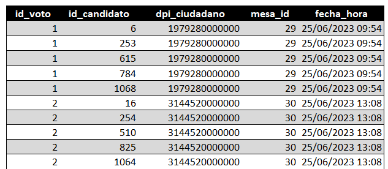
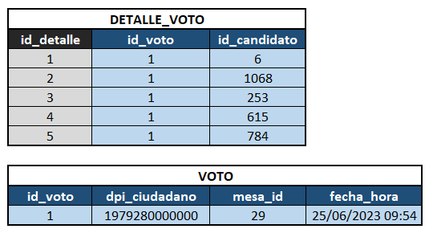
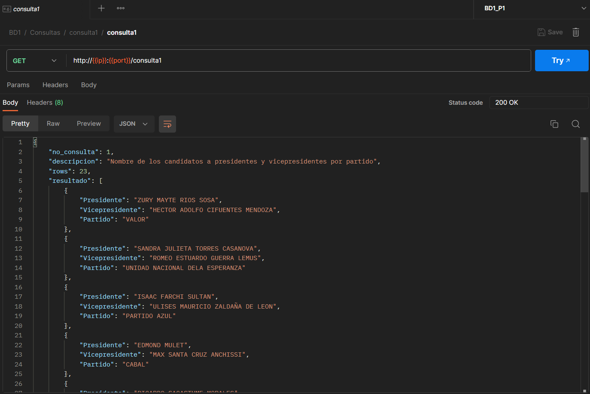

# 📑 MANUAL TÉCNICO [BD1]P1_201901772

```bash
Universidad de San Carlos de Guatemala
Facultad de Ingeniería
Escuela de Ciencias y Sistemas
Laboratorio Sistemas de Bases de Datos 1
Ing. Luis Fernando Espino
Aux. Edin Emanuel Montenegro Vásquez

Carné: 201901772
Nombre: Daniel Reginaldo Dubón Rodríguez
```

## Actividades

- [`Introducción`]()
- [`Modelado de la Base de Datos`](#modelado-de-la-base-de-datos)
  - [`Modelo Conceptual`](#🪧-modelo-conceptual)
  - [`Modelo Lógico`](#🪧-modelo-lógico)
  - [`Modelo Físico`](#🪧-modelo-fisico)
  - [`Scripts`](#📜-scripts)
- [`API`](#requirimientos)
- [`Código Fuente`](#código-fuente)

## Introducción

Se diseñó y desarrolló un sistema de gestión de datos para las elecciones generales de 2023, abarcando un modelo conceptual, lógico y físico de la base de datos, junto con su implementación en MySQL. Además, se creó una API en JavaScript y Node.js para administrar y consultar eficazmente la base de datos, permitiendo la carga masiva de datos y la ejecución de consultas SQL necesarias para el proceso electoral.

## Modelado de la Base de Datos

### 🪧 Modelo Conceptual

<div align="center"></div>

El modelo conceptual se utilizó para definir las entidades y relaciones clave en el sistema, proporcionando una vista de alto nivel de la estructura de datos requerida. Esto ayudó a comprender la estructura general de los datos y las relaciones entre ellos, sin preocuparse por detalles técnicos.

**Entidades Potenciales**
- CUIDADANO
- VOTO
- MESA
- CARGO
- CANDIDATO
- DEPARTAMENTO
- PARTIDO

### 🪧 Modelo Lógico

<div align="center"></div>

En esta fase, se tradujo el modelo conceptual en un diseño lógico más detallado. Se utilizó la herramienta data modeler para definir las tablas, claves primarias y atributos correspondientes considerando las restricciones y reglas de negocio.

Al analizar el archivo de datos [`votaciones.csv`](./Codigo_Fuente/src/dataFiles/votaciones.csv) se pudo notar que habia duplicidad de datos.

<div align="center"></div>


Por lo que se llevo acabo a realizar la primera forma normal a la entidad `VOTO`, dando como resultado dos entidades `VOTO`, `DETALLE_VOTO`, esto nos ayuda a no tener duplicidad de datos.


<div align="center"></div>

También se establecieron de una forma mas lógica las relaciones entre las entidades:

- **CIUDADANO - VOTO**
  
  - *De izquierda a derecha:* Cada ciudadano puede estar asociado con un o muchos votos

  - *De dercha a izquierda:* Cada voto debe estar asociado con un y solamente un ciudadano.
    

- **VOTO - MESA**
  
  - *De izquierda a derecha:* Cada voto debe estar asocidado con una y solamente una mesa

  - *De dercha a izquierda:* Cada mesa puede estar asociado con un o muchos votos

- **MESA - DEPARTAMENTO**
  
  - *De arriba hacia abajo:* Cada mesa debe estar asociado a un y solamente un departamento

  - *De abajo hacia abajo:* Cada departamento puede estar asociado a una o muchas mesas

- **VOTO - DETALLE_VOTO**
  
  - *De arriba hacia abajo:* Cada puede estar asociado a un o muchos detalles de votos

  - *De abajo hacia abajo:* Cada detalle de voto debe estar asociado a un y solamente un voto

- **DETALLE_VOTO - CANDIDATO**
  
  - *De arriba hacia abajo:* Cada detalle voto debe estar asociado a un y solamente un candidato

  - *De abajo hacia abajo:* Cada candidato puede estar asociado a un o muchos detalles de votos

- **CANIDATO - PARTIDO**
  
  - *De izquierda a derecha:* Cada candidato debe estar asociado a un y solamente un partido

  - *De dercha a izquierda:* Cada partido puede estar asociado a un o muchos candidatos

- **CARGO - CANDIDATO**
  
  - *De izquierda a derecha:* Cada cargo puede estar asociado a un o muchos candidatos

  - *De dercha a izquierda:* Cada candidato debe estar asociado a un y solamente un cargo

### 🪧 Modelo Fisico

<div align="center"></div>

- ***TABLA CIUDADANO***
- ***TABLA VOTO***
- ***TABLA MESA***
- ***TABLA DEPARTAMENTO***
- ***TABLA DETALLE_VOTO***
- ***TABLA CANDIDATO***
- ***TABLA CARGO***
- ***TABLA PARTIDO***

### 📜 Scripts


Aquí se ubican los diversos scripts utilizados para ejecutar procesos relacionados con la creación, inserción, manipulación y consulta de datos en la base de datos.

- [`Crear Modelo`](./Scripts/modelo_elecciones.sql)

    Contiene los scripts necesarios para la creación del modelo de la base de datos

- [`Tablas Temporales`](./Scripts/tablas_temporales.sql)

    Contiene los scripts que permiten crear las tablas temporales donde se cargaran temporalmente los datos de las votaciones

- [`Cargar Modelo`](./Scripts/cargar_modelo_elecciones.sql)

    Contiene los scripts que permiten realizar la carga masiva de las tablas temporales al modelo de la base de datos

- [`Consultas`](./Scripts/consultas_modelo_elecciones.sql)

    Contiene las diferentes consultas que se utlizaran en cada EndPoint

- [`Eliminar Modelo`](./Scripts/eliminar_modelo_elecciones.sql)

    Contiene los scripts que permite la eliminacion de modelo de la base de datos junto a sus datos

## API

Esta API fue realizada con el legunaje de programación JavaScript y el entorno de ejecución NodeJS v18.17.0. Por defecto se ejecuta en el puerto 4000

### EndPoints

| EndPoint | Método HTTP | Descripción |
| ------ | :------: | ------ |
| /consulta1 | `GET` | Devuelve el nombre de los candidatos a presidentes y vicepresidentes por partido  |
| /consulta2 | `GET` | Devuelve el número de candidatos a diputados |
| /consulta3 | `GET` | Devuelve el nombre de los candidatos a alcalde por partido  |
| /consulta4 | `GET` | Devuelve la cantidad de candidatos por partido (presidentes, vicepresidentes, diputados, alcaldes). |
| /consulta5 | `GET` | Devuelve la cantidad de votaciones por departamentos |
| /consulta6 | `GET` | Devuelve la cantidad de votos nulos |
| /consulta7 | `GET` | Devuelve el top 10 de edad de ciudadanos que realizaron su voto |
| /consulta8 | `GET` | Devuelve el top 10 de candidatos más votados para presidente y vicepresidente |
| /consulta9 | `GET` | Devuelve el top 5 de mesas más frecuentadas |
| /consulta10 | `GET` | Devuelve el top 5 la hora más concurrida en que los ciudadanos fueron a votar  |
| /consulta11 | `GET` | Devuelve la cantidad de votos por género |

**Ejemplo**
```JavaScript
http://${ip}:${port}/consulta1
```

<div align="center"></div>

## Código Fuente

### Requerimientos

- **API**

    - NodeJS v18.17.0
    - Postman/Insomia o alguna otra aplicacion que permita hacer peticones HTTP

- **BASE DE DATOS**

    - MySQL v8.1.0
    - DataGrip/WorkBench/DBeaver

- **SOURCE**

  - [`API`](./Codigo_Fuente)
  - [`Script`](./Scripts)
  - [`Modelos`](./Modelos)